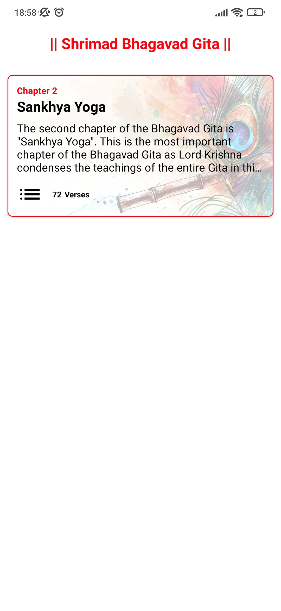

# Bhagavad Gita App
This Android application brings the timeless wisdom of the Bhagavad Gita to your fingertips, offering a rich and immersive experience for spiritual seekers.

## Features:

Complete Bhagavad Gita: 
Explore all 18 chapters and 700 verses with detailed translations, making the knowledge of the Gita accessible to a wider audience.
Verse of the Day: 
Receive daily inspiration with a thoughtfully chosen verse delivered each morning.
Offline Access: 
Save chapters and verses for offline reading and listening, ensuring you can connect with the Gita's teachings even without an internet connection.
Text-to-Speech Functionality: 
Deepen your spiritual experience by listening to the verses recited through the app's text-to-speech feature.

## Tech Stack:

Android Studio: The primary development environment used to build the app.
Kotlin: The modern programming language chosen for its efficiency and readability.
XML: Used for designing the app's user interface layouts.
Figma: A design tool potentially used for creating mockups and designing the app's UI.

## Installation
### Clone the repository:
https://github.com/Rishi2419/Bhagavad-Gita/tree/main

Open the project in Android Studio.
Sync the Gradle dependencies.
Set up Firebase by adding your google-services.json file to the project.
Run the project on an emulator or a physical device.

## For a visual walkthrough of TeamUp!'s functionalities, check out the demo video here:
https://www.linkedin.com/posts/rishikesh-sahu-error_appdevelopment-androidstudio-kotlin-activity-7262847131701432321-oQd_?utm_source=share&utm_medium=member_desktop

## Screenshots

<table>
  <tr table border="0">
    <td></td>
    <td></td>
    <td></td>
  </tr>
  <tr>
    <td></td>
    <td></td>
    <td></td>
  </tr>
  <tr>
    <td></td>
  </tr>
</table>
